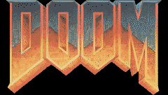

# DOOM Fire Demo

This is a demo of the [DOOM fire effect][], as implemented by Fabien Sanglard.
I wrote it in WASM because doing the effect in Lua was too slow.

## How does it work?

[Read the blog post, it describes it better than I could.][DOOM fire effect]

## No, like, the TIC-80 side of it!

Oh, right.

Basically, TIC-80 can use 31 colors per frame (without scanline trickery).
That's 16 colors in vbank 0, and 15 colors in vbank 1 (formerly called OVR).
The reason vbank1 has one less color is because one color is sacrificed to
allow for transparency between the two vbanks.

So by ditching 6 of the 37 colors in the original palette, we can use 31 of
those colors to complete the effect in TIC-80 without even needing the
aforementioned scanline trickery.

We keep a framebuffer array, like [Fabien's implementation][fsimpl], but
instead of drawing the framebuffer every frame (which would be slow as hell
since TIC-80 is decidedly not built to draw over 32 thousand pixels per frame),
we draw to TIC-80's internal framebuffers (both vbanks) whenever we update our
framebuffer. Other than that, the logic is almost exactly the same as Fabien's
implementation, if expressed slightly differently (and, of course, accounting
for our 31 colors instead of the 37 colors of the original DOOM fire).

The only real notable thing about the drawing logic is that we don't update the
framebuffer until *after* we've drawn the pixel. This allows us to ensure that
we clear the pixel in vbank 1 if we're going from a vbank 1 color to a vbank 0
color. Otherwise, the vbank 1 color lingers and, since vbank 1 renders over
vbank 0, we don't get to see the new color underneath. Other than that, it's
pretty stock-standard.

## Okay, but how much faster is this WASM cart than the same cart in Lua?

If I include benchmarking code (which slows down the cart, obviously), I can
get an estimated average FPS of 100-132 (this means that a hypothetical TIC-80
with no framerate lock would run this about as well as a low-end gaming PC runs
Minecraft). My Lua implementation was barely pushing 45 FPS.

[DOOM fire effect]: https://fabiensanglard.net/doom_fire_psx/
[fsimpl]: https://github.com/fabiensanglard/DoomFirePSX/blob/master/flames.html
